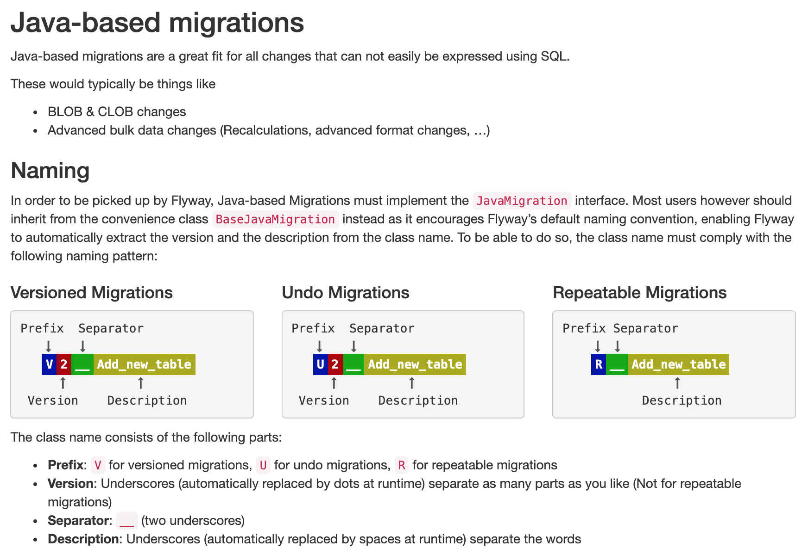

# Package for Java based Flyway migrations

This package is set up to contain Flyway database migration written in Java.

Typically java based migrations are used to perform data migration tasks tha require 
specific checks or data manipulation that are not simple to perform in SQL.  

The SQL based Flyway migration are in resources/db/migration.

More info on Java migrations: https://flywaydb.org/getstarted/java

## [How to name java migrations](https://flywaydb.org/documentation/migrations#java-based-migrations)

