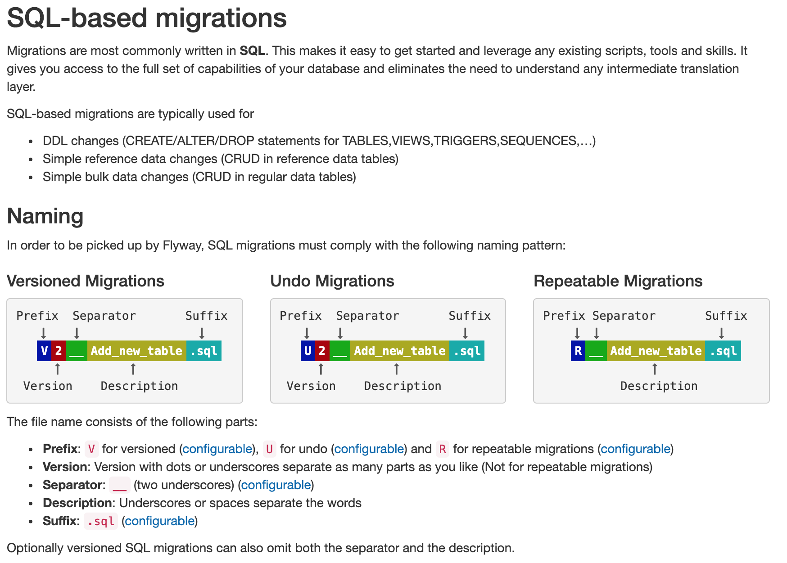

# Package for SQL based Flyway migrations

This package is set up to contain Flyway database migration written in SQL.

Typically SQL based migrations are used to perform structural operations on the DB (DDL),
like adding tables, indexes or columns, and to perform basic data migration tasks,
like moving data from one table to another, entering defaults or recalculating values.

Data tasks tha require specific checks (even external to the DB) or data manipulation 
that are not simple to perform in SQL can be done with Java migrations.  

The JAVA based Flyway migration are in java/db/migration.

### [How to name SQL migrations](https://flywaydb.org/documentation/migrations#naming)

