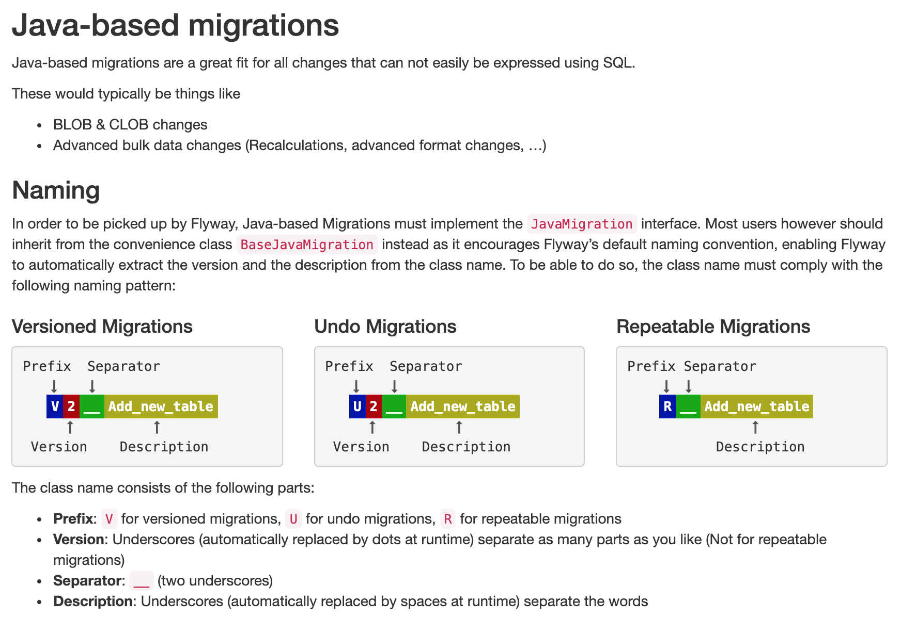

# TEST -Java based- Flyway migrations

**This folder is for _JAVA Flyway DB migrations_ to be applied only in tests**.

Typically java based migrations are used to perform data migration tasks tha require 
specific checks or data manipulation that are not simple to perform in SQL.  

The SQL based Flyway migration are in `resources/db/migration`.

More info on Java migrations: https://flywaydb.org/getstarted/java

### Naming JAVA migrations
Below is a quick reference image from the Flyway site.  
For the full story [go to the Flyway site](https://flywaydb.org/documentation/migrations#java-based-migrations)  

