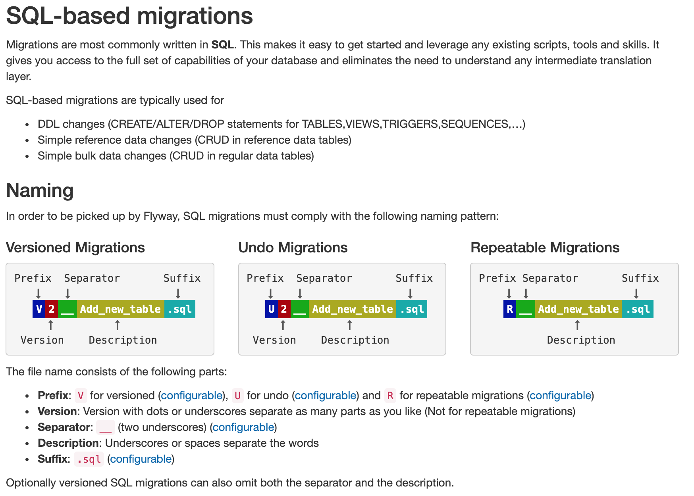

# Resource folder for TEST SQL based Flyway migrations

**This folder is for _SQL Flyway DB migrations_ to be applied only in tests**.

## Process to test and apply migrations
 1. Create the migration in a Flyway folder in the `test` code tree (like this one).  
 This is so that:
    * You can apply the migration when running the tests
    * There is no risk te migration is applied in production  

 2. Test the migration on your development branch.  
 Test it against both the default in-memory DB and the test instance of your real DB !
 
 3. When you are ready to release the migration, move the migration file to the 
 equivalent folder in the `main` code tree.
    * This will make the migration file available in the `main` code resource bundle,
    so that it will be included in the jars generated for deployment
    * The resources in the `main` code tree are available for the test code.
 
 4. Deploy and Restart the app in production so that the Flyway migration is applied.
 
Quick link to [production migrations README](../../../../../src/main/resources/db/migration/README.md) :)

### Naming SQL migrations
Below is a quick reference image from the Flyway site.  
For the full story [go to the Flyway site](https://flywaydb.org/documentation/migrations#sql-based-migrations)  

